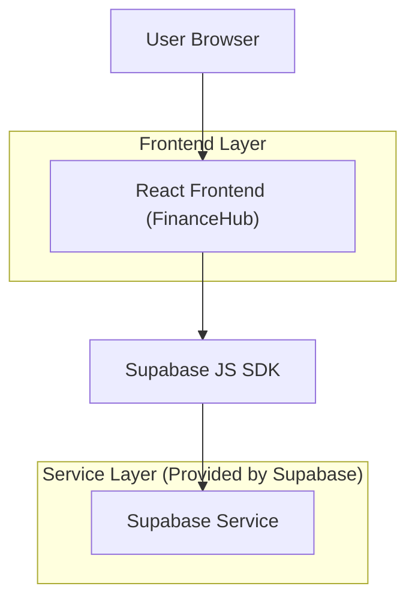
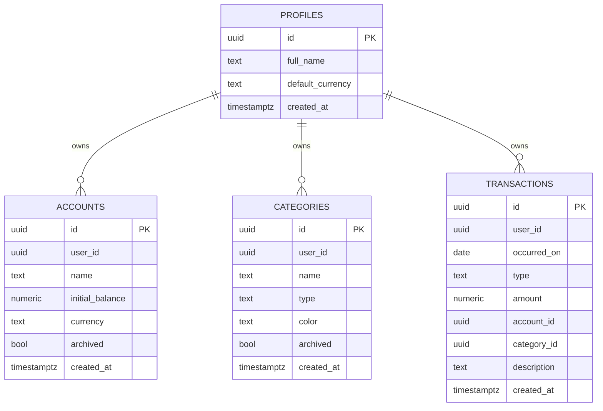

## 1.Architecture design


## 2.Technology Description
- Frontend: React@18 + TypeScript + vite + tailwindcss@3
- Backend: Supabase (Auth + Postgres + Storage opcional)

## 3.Route definitions
| Route | Purpose |
|-------|---------|
| /auth | Login, cadastro e recuperação de senha |
| / | Redirecionar para /dashboard quando autenticado |
| /dashboard | Resumo do período, saldos e gastos por categoria |
| /transactions | CRUD e filtros de transações |
| /settings | Contas e categorias |

## 4.API definitions (If it includes backend services)
### 4.1 Tipos principais (TypeScript)
```ts
export type Account = {
  id: string; user_id: string;
  name: string; initial_balance: number;
  currency: string; archived: boolean;
  created_at: string;
};

export type Category = {
  id: string; user_id: string;
  name: string; type: "income" | "expense";
  color?: string | null; archived: boolean;
  created_at: string;
};

export type Transaction = {
  id: string; user_id: string;
  occurred_on: string; // yyyy-mm-dd
  type: "income" | "expense";
  amount: number;
  account_id: string;
  category_id?: string | null;
  description?: string | null;
  created_at: string;
};
```

### 4.2 Endpoints essenciais (PostgREST do Supabase)
Autenticação (via SDK):
- signUp / signInWithPassword / resetPasswordForEmail

Dados (base path típico):
- GET/POST/PATCH/DELETE /rest/v1/accounts
- GET/POST/PATCH/DELETE /rest/v1/categories
- GET/POST/PATCH/DELETE /rest/v1/transactions

Consultas do Dashboard (mínimas)
- GET /rest/v1/transactions?select=amount,type,category_id,account_id&occurred_on=gte.{ini}&occurred_on=lte.{fim}

## 6.Data model(if applicable)
### 6.1 Data model definition


### 6.2 Data Definition Language
```sql
-- PROFILES (1:1 lógico com auth.users)
CREATE TABLE profiles (
  id UUID PRIMARY KEY, -- igual ao auth.users.id
  full_name TEXT,
  default_currency TEXT DEFAULT 'BRL',
  created_at TIMESTAMPTZ DEFAULT now()
);

CREATE TABLE accounts (
  id UUID PRIMARY KEY DEFAULT gen_random_uuid(),
  user_id UUID NOT NULL,
  name TEXT NOT NULL,
  initial_balance NUMERIC(14,2) NOT NULL DEFAULT 0,
  currency TEXT NOT NULL DEFAULT 'BRL',
  archived BOOLEAN NOT NULL DEFAULT false,
  created_at TIMESTAMPTZ DEFAULT now()
);
CREATE INDEX idx_accounts_user_id ON accounts(user_id);

CREATE TABLE categories (
  id UUID PRIMARY KEY DEFAULT gen_random_uuid(),
  user_id UUID NOT NULL,
  name TEXT NOT NULL,
  type TEXT NOT NULL CHECK (type IN ('income','expense')),
  color TEXT,
  archived BOOLEAN NOT NULL DEFAULT false,
  created_at TIMESTAMPTZ DEFAULT now()
);
CREATE INDEX idx_categories_user_id ON categories(user_id);

CREATE TABLE transactions (
  id UUID PRIMARY KEY DEFAULT gen_random_uuid(),
  user_id UUID NOT NULL,
  occurred_on DATE NOT NULL,
  type TEXT NOT NULL CHECK (type IN ('income','expense')),
  amount NUMERIC(14,2) NOT NULL CHECK (amount > 0),
  account_id UUID NOT NULL,
  category_id UUID,
  description TEXT,
  created_at TIMESTAMPTZ DEFAULT now()
);
CREATE INDEX idx_tx_user_date ON transactions(user_id, occurred_on DESC);
CREATE INDEX idx_tx_account_id ON transactions(account_id);
CREATE INDEX idx_tx_category_id ON transactions(category_id);

-- RLS
ALTER TABLE profiles ENABLE ROW LEVEL SECURITY;
ALTER TABLE accounts ENABLE ROW LEVEL SECURITY;
ALTER TABLE categories ENABLE ROW LEVEL SECURITY;
ALTER TABLE transactions ENABLE ROW LEVEL SECURITY;

-- Policies (usuário acessa apenas seus dados)
CREATE POLICY "profiles_read_own" ON profiles
  FOR SELECT TO authenticated
  USING (id = auth.uid());
CREATE POLICY "profiles_upsert_own" ON profiles
  FOR ALL TO authenticated
  USING (id = auth.uid()) WITH CHECK (id = auth.uid());

CREATE POLICY "accounts_crud_own" ON accounts
  FOR ALL TO authenticated
  USING (user_id = auth.uid())
  WITH CHECK (user_id = auth.uid());

CREATE POLICY "categories_crud_own" ON categories
  FOR ALL TO authenticated
  USING (user_id = auth.uid())
  WITH CHECK (user_id = auth.uid());

CREATE POLICY "transactions_crud_own" ON transactions
  FOR ALL TO authenticated
  USING (user_id = auth.uid())
  WITH CHECK (user_id = auth.uid());

-- Grants (diretriz Supabase)
GRANT SELECT ON profiles, accounts, categories, transactions TO anon;
GRANT ALL PRIVILEGES ON profiles, accounts, categories, transactions TO authenticated;
```