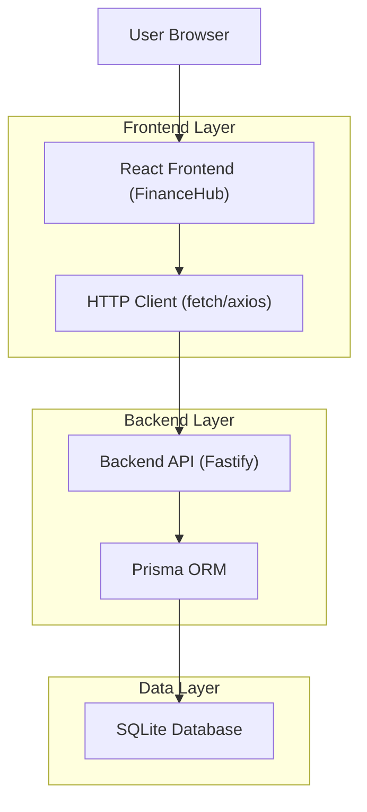
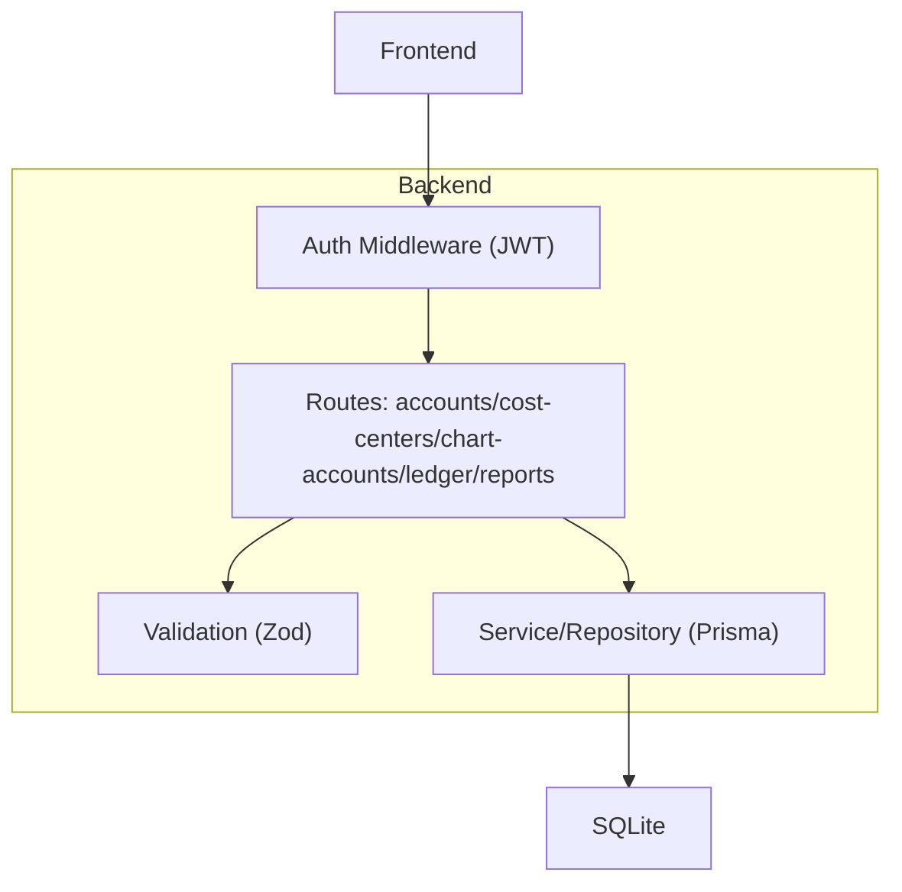
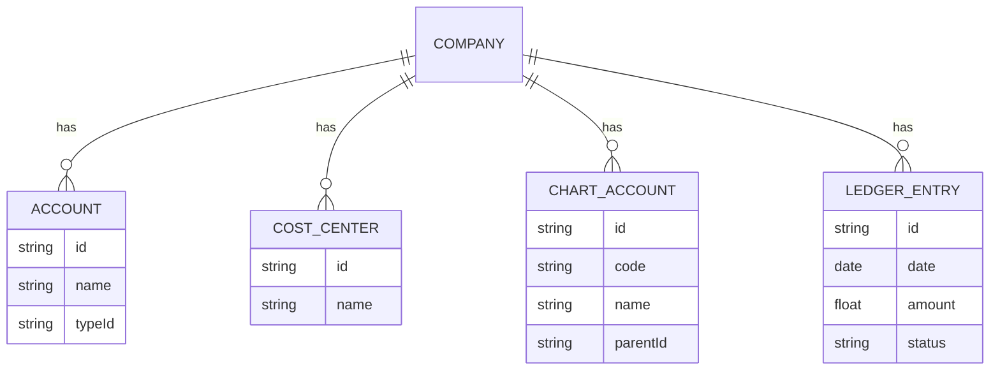

## 1.Architecture design


## 2.Technology Description
- Frontend: React@18 + TypeScript + vite + tailwindcss@3 + shadcn/ui (Radix) + @tanstack/react-query
- Backend: API REST existente (Fastify + JWT)

## 3.Route definitions
| Route | Purpose |
|-------|---------|
| / | Shell do app (Index) + menu lateral/topo |
| (interno: currentPage=dashboard) | Dashboard e atalhos para os módulos financeiros |
| (interno: currentPage=cadastrosFinanceiros) | Cadastros: Contas, Centros de Custo, Plano de Contas (tabs) |
| (interno: currentPage=ledger) | Livro-caixa (lançamentos) |
| (interno: currentPage=reports) | Relatórios (Extrato + DRE) |

## 4.API definitions (If it includes backend services)
### 4.1 Endpoints (contrato do backend já existente)
- Contas: `GET /accounts`, `POST /accounts`, `PATCH /accounts/:id`, `GET /accounts/types`
- Centros de custo: `GET /cost-centers`, `POST /cost-centers`, `PATCH /cost-centers/:id`
- Plano de contas: `GET /chart-accounts`, `POST /chart-accounts`, `PATCH /chart-accounts/:id`, `DELETE /chart-accounts/:id`
- Livro-caixa: `GET /ledger`, `POST /ledger`, `PUT /ledger/:id`, `DELETE /ledger/:id`, `POST /ledger/:id/confirm`
- Relatórios: `GET /reports/statement`, `POST /reports/dre/run`

### 4.2 Autenticação e escopo
- Enviar `Authorization: Bearer <token>` em todas as rotas protegidas.
- Para usuário `ADMIN`, suportar `X-Company-Id: <companyId>` para operar no escopo da empresa selecionada.

### 4.3 Tipos TypeScript (compartilháveis no frontend)
```ts
export type UUID = string;

export type AccountType = {
  id: string;
  name: string;
};

export type Account = {
  id: UUID;
  code?: string;
  name: string;
  typeId: string;
  active?: boolean;
};

export type CostCenter = {
  id: UUID;
  code?: string;
  name: string;
  active?: boolean;
};

export type ChartAccount = {
  id: UUID;
  code: string;
  name: string;
  level?: number;
  parentId?: UUID | null;
  active?: boolean;
};

export type LedgerEntry = {
  id: UUID;
  date: string; // ISO
  description: string;
  amount: number; // +receita / -despesa (convenção do backend)
  accountId?: UUID;
  costCenterId?: UUID;
  status: "PENDING" | "CONFIRMED";
};

export type StatementRow = {
  date: string;
  description: string;
  amount: number;
  balance?: number;
};

export type DreLine = {
  code: string;
  name: string;
  value: number;
  children?: DreLine[];
};
```

## 5.Server architecture diagram (If it includes backend services)


## 6.Data model(if applicable)
### 6.1 Data model definition

