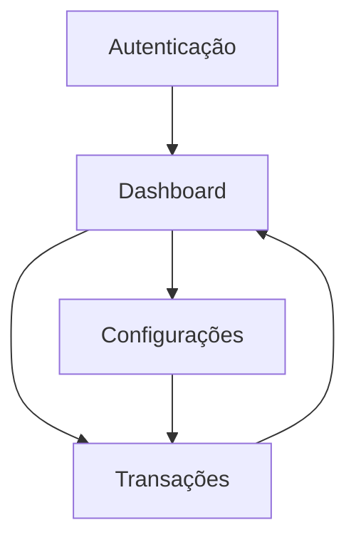

## 1. Product Overview
FinanceHub é um app web para registrar despesas/receitas e acompanhar o saldo por contas, com visão de resumo por período.
Foco no MVP: entrada rápida de transações, categorização e um dashboard claro para tomada de decisão.

## 2. Core Features

### 2.1 User Roles
| Papel | Método de cadastro | Permissões principais |
|------|---------------------|----------------------|
| Usuário | Email/senha (Supabase Auth) | Acessa e gerencia apenas seus próprios dados financeiros |

### 2.2 Feature Module
O MVP do FinanceHub consiste nas seguintes páginas principais:
1. **Autenticação**: login, cadastro, recuperação de senha.
2. **Dashboard**: resumo do período, saldo por conta, gastos por categoria.
3. **Transações**: listar, criar, editar, excluir; filtros por período/conta/categoria.
4. **Configurações**: gerenciar contas (carteiras) e categorias.

### 2.3 Page Details
| Page Name | Module Name | Feature description |
|-----------|-------------|---------------------|
| Autenticação | Login/Cadastro | Autenticar por email/senha; criar conta; recuperar senha; redirecionar para Dashboard após sucesso. |
| Dashboard | Seletor de período | Selecionar mês atual por padrão; trocar período para recalcular métricas. |
| Dashboard | Cards de resumo | Exibir total de receitas, despesas e saldo do período. |
| Dashboard | Saldos por conta | Mostrar saldo atual por conta; permitir navegar para Transações filtradas pela conta. |
| Dashboard | Gastos por categoria | Mostrar ranking/percentual de despesas por categoria no período. |
| Transações | Lista e filtros | Listar transações do período; filtrar por conta/categoria/tipo (receita/despesa) e buscar por descrição. |
| Transações | CRUD de transação | Criar/editar/excluir transação com: data, tipo, valor, conta, categoria (opcional), descrição (opcional). |
| Configurações | Contas | Criar/editar/arquivar contas; definir saldo inicial; impedir exclusão se houver transações (ou orientar arquivamento). |
| Configurações | Categorias | Criar/editar/arquivar categorias; escolher cor/ícone opcional para identificação visual. |

## 3. Core Process
**Fluxo do Usuário (MVP)**
1. Você cria conta ou faz login.
2. No Dashboard, você vê o resumo do mês atual e escolhe um período.
3. Você registra receitas e despesas em Transações (com conta e, se aplicável, categoria).
4. Você ajusta Contas e Categorias em Configurações para manter a organização.

