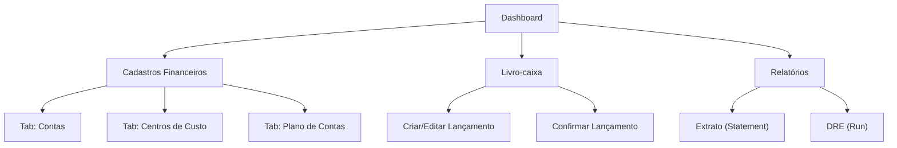

## 1. Product Overview
Importar e operacionalizar no frontend do FinanceHub os módulos financeiros de Cadastro (Contas, Centros de Custo e Plano de Contas), Livro-caixa e Relatórios, consumindo a API REST já existente.
O objetivo é substituir dados mockados por dados reais e habilitar operações de consulta e manutenção (CRUD) com segurança por empresa.

## 2. Core Features

### 2.1 User Roles
| Role | Registration Method | Core Permissions |
|------|---------------------|------------------|
| Admin | Usuário existente (seed / gestão interna) | Selecionar empresa via header, gerenciar cadastros e operar livro-caixa, executar relatórios |
| Operador | Usuário existente | Operar nos dados da própria empresa: cadastros, livro-caixa, relatórios |
| Cliente | Usuário existente | Consultar livro-caixa e relatórios da própria empresa (somente leitura, se backend aplicar) |

### 2.2 Feature Module
Os requisitos consistem nas seguintes páginas principais:
1. **Dashboard (entrada do app)**: atalhos/links para Cadastros Financeiros, Livro-caixa e Relatórios.
2. **Cadastros Financeiros**: tabs para Contas, Centros de Custo e Plano de Contas; listagem + criação/edição/exclusão (quando aplicável).
3. **Livro-caixa**: listagem filtrável, criação/edição, confirmação de lançamento e remoção (soft delete quando aplicável).
4. **Relatórios**: extrato (statement) e execução de DRE (run) com filtros e visualização do resultado.

### 2.3 Page Details
| Page Name | Module Name | Feature description |
|-----------|-------------|---------------------|
| Dashboard | Navegação | Exibir cards/atalhos para abrir Cadastros Financeiros, Livro-caixa e Relatórios no menu atual (currentPage) |
| Cadastros Financeiros | Estrutura de tabs | Alternar entre tabs Contas, Centros de Custo e Plano de Contas mantendo estado de filtros/pesquisa por tab |
| Cadastros Financeiros | Contas (listagem) | Listar contas via API; pesquisar por nome/código; exibir tipo; tratar loading/empty/error |
| Cadastros Financeiros | Contas (manutenção) | Criar e editar conta com validação de campos; salvar via API; atualizar lista após sucesso |
| Cadastros Financeiros | Contas (tipos) | Carregar tipos de conta via API e usar como opções de seleção no formulário |
| Cadastros Financeiros | Centros de Custo (listagem) | Listar centros de custo via API; pesquisar por nome/código; tratar loading/empty/error |
| Cadastros Financeiros | Centros de Custo (manutenção) | Criar e editar centro de custo; salvar via API; atualizar lista após sucesso |
| Cadastros Financeiros | Plano de Contas (listagem) | Listar plano de contas via API; filtrar por nível/categoria; exibir hierarquia (se vier do backend) |
| Cadastros Financeiros | Plano de Contas (manutenção) | Criar e editar conta contábil; salvar via API; atualizar lista após sucesso |
| Cadastros Financeiros | Plano de Contas (exclusão) | Excluir item do plano de contas via API (com confirmação) |
| Livro-caixa | Filtros | Filtrar por período (data inicial/final), status (confirmado/pendente), conta e centro de custo; sincronizar filtros com a listagem |
| Livro-caixa | Lançamentos (listagem) | Listar lançamentos do livro-caixa via API; exibir colunas essenciais (data, histórico, valor, conta, centro de custo, status) |
| Livro-caixa | Lançamentos (criar/editar) | Criar e editar lançamento com validação; salvar via API; revalidar listagem |
| Livro-caixa | Lançamentos (confirmar) | Confirmar lançamento via API; refletir status na lista sem recarregar a página |
| Livro-caixa | Lançamentos (remover) | Remover lançamento via API (soft delete se backend aplicar), com diálogo de confirmação |
| Relatórios | Extrato (statement) | Consultar extrato via API com filtros (período/conta) e exibir resultado em tabela com totais básicos |
| Relatórios | DRE (run) | Executar DRE via API com parâmetros mínimos (ex.: período) e exibir resultado de forma estruturada |
| Relatórios | Estados de tela | Padronizar estados de carregamento, vazio, erro e “sem permissão” ao consumir API protegida |

## 3. Core Process
**Fluxo (Admin)**: você faz login no FinanceHub, seleciona/atua em uma empresa (quando aplicável), acessa Cadastros Financeiros para manter Contas/Centros de Custo/Plano de Contas, registra e confirma lançamentos no Livro-caixa, e por fim gera Relatórios (Extrato e DRE) para análise.

**Fluxo (Operador/Cliente)**: você faz login e opera apenas no escopo da sua empresa; acessa Cadastros (se permitido), consulta/lança no Livro-caixa (se permitido) e executa Relatórios.

